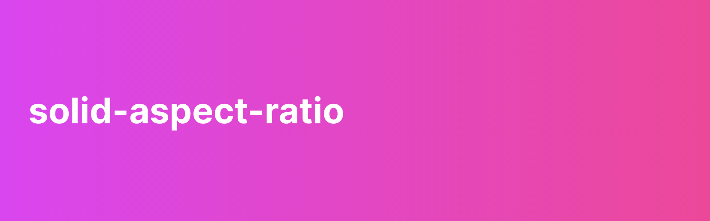

<p>
  
</p>

Creates a component with a proportional relationship between its width and height.

`ratio = width / height`

Internally, TailwindCSS to achieve the intended aspect ratio.

[](https://www.npmjs.com/package/solid-aspect-ratio)


## Table of Contents
 - [Installation](#installation)
 - [Setup](#setup)
 - [Usage](#usage)
 - [Authors](#authors)
 - [Changelog](#changelog)
 - [License](#license)

 <!-- toc -->
## Installation

This library is available through the [npm registry](https://www.npmjs.com/).

NPM
```bash
$ npm -i solid-aspect-ratio
```

Yarn
```bash
$ yarn add solid-aspect-ratio
```

## Setup

Start using it by importing the library first.

### CommonJS
```javascript
const AspectRatio = require('solid-aspect-ratio');
```

or 

### ES6
```javascript
import AspectRatio from 'solid-aspect-ratio';
```

## Usage

```javascript
import AspectRatio from 'solid-aspect-ratio';

export default function Sample() {
  return (
    <AspectRatio ratio="3/4" />
    <AspectRatio ratio={0.75} /> // Same as "3/4"
  );
}
```

## Authors

- [Prince Neil Cedrick Castro](https://github.com/git-ced/) - Initial work

See also the list of [contributors](https://github.com/git-ced/solid-aspect-ratio/contributors) who participated in this project.

## Changelog

[Changelog](https://github.com/git-ced/solid-aspect-ratio/releases)

## License

  [MIT](LICENSE)
